# Awesome ThinkCentres

These machines can be found used for about 100-250 usd/eur. Most often found with 6 core cpu-s (8400t/9400t), single 8gb ram sticks and smaller 256/512gb M.2 nvme drive, and wifi configurations.

What is this is good for?

- homelab
- k8s nodes
- NAS/router
- dev/test boxes

Models covered:

- M720q
- M920q/x
- P330 tiny (Same as M920q but with 2x m.2, ie like an M920x)

|                                     |                                               |                                         |                                     |
| ----------------------------------- | --------------------------------------------- | --------------------------------------- | ----------------------------------- |
| 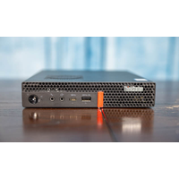 | 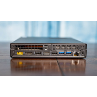 | 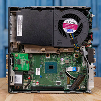 | 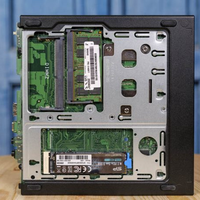 |


---

## Awesome projects

| Image                                       | Project                                                                                                                                                                   |
| ------------------------------------------- | ------------------------------------------------------------------------------------------------------------------------------------------------------------------------- |
| 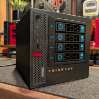             | [4 Bay NAS](https://www.reddit.com/r/homelab/comments/1qllfjn/thinkbox_released_diy_4bay_nas_and_powerful/)                                                               |
|                                             | [Kubernetes cluster](https://blog.zolty.systems/posts/2026-02-07-choosing-the-hardware)                                                                                   |
| 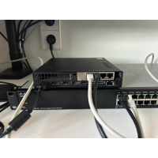           | [OPFsense box/router](https://www.reddit.com/r/homelab/comments/1lvnv72/built_a_opnsense_router_from_a_lenovo_m720q_intel/?utm_source=chatgpt.com)                        |
|                                             | [CEPH Distributed Storage mesh](https://heck.sh/posts/10g-ceph-mesh-tinyminimicro/)                                                                                       |
|  | [ThinkNAS - 2x HDD enclosure for Lenovo M920q](https://makerworld.com/en/models/1280680-thinknas-2x-hdd-enclosure-for-lenovo-m920q?from=search#profileId-1308483)         |
| 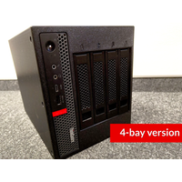 | [ThinkNAS - 4x HDD NAS enclosure for Lenovo M920q](https://makerworld.com/en/models/1399535-thinknas-4x-hdd-nas-enclosure-for-lenovo-m920q?from=search#profileId-1451077) |
| 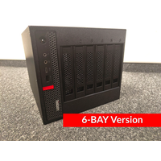 | [ThinkNAS - 6x HDD NAS enclosure for Lenovo M920q](https://makerworld.com/en/models/1737570-thinknas-6x-hdd-nas-enclosure-for-lenovo-m920q#profileId-1846272)             |
| 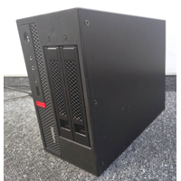           | [ThinkLab - 6 Bay Home Lab - M920q](https://makerworld.com/en/models/1754167-thinklab-6-bay-home-lab-m920q?from=search#profileId-1865265)                                 |
| 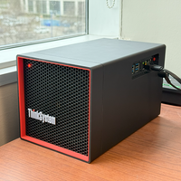         | [THINK NAS - Lenovo Think Style NAS Case](https://makerworld.com/en/models/1368836-think-nas-lenovo-think-style-nas-case?from=search#profileId-1415019)                   |

---

## Features

| Model | RAM         | Storage                      | USB                       | Video     | Network | spec sheet                                                                                                                        |
| ----- | ----------- | ---------------------------- | ------------------------- | --------- | ------- | --------------------------------------------------------------------------------------------------------------------------------- |
| M720q | 2x32GB DDR4 | 2.5" SATA + M.2 2242/2280*   | USB 3.1 Gen1/Gen2 + USB-C | HDMI + DP | 1Gbit   | [spec sheet](https://psref.lenovo.com/syspool/Sys/PDF/ThinkCentre/ThinkCentre_M720_Tiny/ThinkCentre_M720_Tiny_Spec.pdf)           |
| M920q | 2x32GB DDR4 | 2.5" SATA + M.2 2242/2280**  | USB 3.1 Gen1/Gen2 + USB-C | HDMI + DP | 1Gbit   | [spec sheet](https://psref.lenovo.com/syspool/Sys/PDF/ThinkCentre/ThinkCentre_M920_Tiny/ThinkCentre_M920_Tiny_Spec.PDF)           |
| M920x | 2x32GB DDR4 | 2.5" SATA + 2x M.2 2242/2280 | USB 3.1 Gen1/Gen2 + USB-C | HDMI + DP | 1Gbit   | [spec sheet](https://static.lenovo.com/shop/emea/content/pdf/ThinkCentre/MSeries/2018/M920x/ThinkCentre%20M920x%20Tiny_DS_EN.pdf) |
| P330  | 2x32GB DDR4 | 2.5" SATA + 2x M.2 2242/2280 | USB 3.1 Gen1/Gen2 + USB-C | HDMI + DP | 1Gbit   | [spec sheet](https://psref.lenovo.com/syspool/Sys/PDF/ThinkStation/ThinkStation_P330_Tiny/ThinkStation_P330_Tiny_Spec.pdf)        |

```
* can be modded with additional M.2 SATA slot
** can be modded with additional M.2 NVME slot
```


### Common CPU configurations

| CPU                              | Cores | Threads | Why                           |
| -------------------------------- | ----- | ------- | ----------------------------- |
| i5-8500T                         | 6     | 6       | best value / very common      |
| i5-8400T                         | 6     | 6       | cheaper alternative           |
| i7-8700T                         | 6     | 12      | highest performance in class  |
| i5-9500T                         | 6     | 6       | newer stepping, stable        |
| i5-9600T                         | 6     | 6       | slightly higher boost         |
| i7-9700T                         | 8     | 8       | 8 cores for heavy workloads   |
| i3-8100                          | 4     | 4       | low core count, not worth it  |
| i3-9100                          | 4     | 4       | weak for multi-tasking        |
| Celeron / Pentium (G49xx, G54xx) | 2     | 2–4     | too slow for most homelab use |

## Reviews/info

| Image                                                       | Name                                                                                                                                                                                                                                      |
| ----------------------------------------------------------- | ----------------------------------------------------------------------------------------------------------------------------------------------------------------------------------------------------------------------------------------- |
| 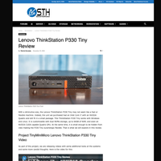                           | [ServeTheHome: Lenovo ThinkStation P330 Tiny Review](https://www.servethehome.com/lenovo-thinkstation-p330-tiny-review-intel-nvidia-quadro/)                                                                                              |
| 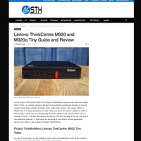                           | [ServeTheHome: Lenovo ThinkCentre M920 and M920q Tiny Guide and Review](https://www.servethehome.com/lenovo-thinkcentre-m920-and-m920q-tiny-guide-and-review/)                                                                            |
| 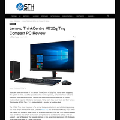                         | [ServeTheHome: Lenovo ThinkCentre M720q Tiny Compact PC Review](https://www.servethehome.com/lenovo-thinkcentre-m720q-tiny-compact-pc-review/)                                                                                            |
| 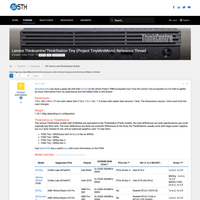 | [ServeTheHome Forum: Lenovo Thinkcentre/ThinkStation Tiny (Project TinyMiniMicro) Reference Thread](https://forums.servethehome.com/index.php?threads/lenovo-thinkcentre-thinkstation-tiny-project-tinyminimicro-reference-thread.34925/) |
| 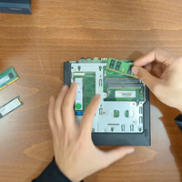             | [Youtube: Lenovo ThinkCentre M920Q Tiny - Teardown and Upgrade SSD, RAM, CPU in 4K](https://www.youtube.com/watch?v=hHJpXFjRBLw)                                                                                                          |

---

### Mods/upgrades

[M920q extra M.2 nvme](https://github.com/badger707/m920q-dual-NVME)

[M720q extra M.2 sata mod](https://github.com/badger707/m920q-dual-NVME)

### PCIE Risers

| Image                                                         | Name                                                                    | Extra Features                                 | Purchase link                                                                                   | License       |
| ------------------------------------------------------------- | ----------------------------------------------------------------------- | ---------------------------------------------- | ----------------------------------------------------------------------------------------------- | ------------- |
| 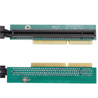                     | Lenovo style riser                                                      |                                                | [Aliexpress](https://www.aliexpress.com/item/1005010038222767.html)                             | Official      |
| 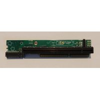 | [Tinyriser](https://github.com/a-little-wifi/Tinyriser)                 | M.2 NVME slot (Vertical) not for SATA drives   | [Tindie](https://www.tindie.com/search/?q=tinyriser)                                            | Open source   |
| 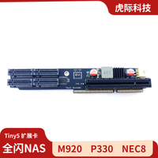                           | [LenovoTiny5PcieCard](https://github.com/qq8322302/LenovoTiny5PcieCard) | 4x M.2 NVME slot* not for SATA drives          | [Taobao](https://item.taobao.com/item.htm?id=993356165215/)                                     | Closed source |
| 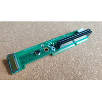                         | [PowerRiser](https://github.com/nandfarm/PowerRiser/tree/main)          | M.2 NVME slot (Horizontal) not for SATA drives | [Tindie](https://www.tindie.com/products/nandfarm/powerriser-by-nandfarm-pcie-riser-for-tiny5/) | Open source   |

```
* Requires custom BIOS, and hardware beyond the riser
```

### 2.5G Network Interface

You can replace the M.2 Wifi card for 2.5G Ethernet

| Image                                 | Name                                                                                                                                  |
| ------------------------------------- | ------------------------------------------------------------------------------------------------------------------------------------- |
| 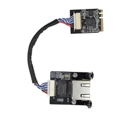   | [Industrial Grade M.2 A and E Intel i226V Customized 2.5G Ethernet Server NIC](https://www.aliexpress.com/item/1005008612570820.html) |
| 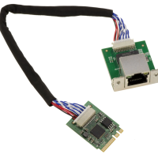 | [M2 E A Key Karte 2.5 Gigabit RJ45 LAN ETHERNET 1G 2.5G Intel I226 SRKTV](https://www.ebay.de/itm/306178342372)                       |

---

## PCIE cards

To be able to add a pcie card you will need a PCIE expansion riser card.

The following cards have been reported to fit these machines

### Networking

| Image                                             | Name                | Purpose                                                        | Notes                                                                  |
| ------------------------------------------------- | ------------------- | -------------------------------------------------------------- | ---------------------------------------------------------------------- |
| 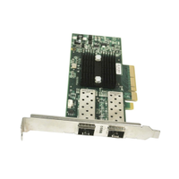                 | Mellanox ConnectX-3 | (single/dual) 10Gbit, 40Gbit, InfiniBand 56Gbit                | Sold under many brands, different products have different capabilities |
| 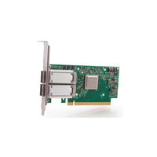                 | Mellanox ConnectX-4 | (single/dual) 10Gbit, 40Gbit, 50Gbit, 100G, InfiniBand 100Gbit | Sold under many brands, different products have different capabilities |
| 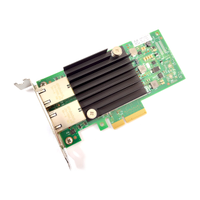                 | Intel X550          | 2x 10Gbit Ethernet                                             | The ethernet 10Gbit might run too hot without an added fan             |
| 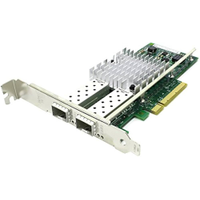                 | Intel X520          | 2x 10Gbit                                                      |                                                                        |
| 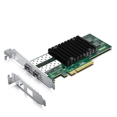                 | Intel X710          |                                                                |                                                                        |
| 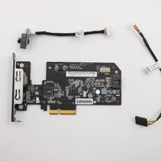           | Thunderbolt Card    | 40 Gbit thunderbolt                                            |                                                                        |
| 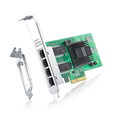                   | Intel i350-AM4      | 4x Gbit ethernet                                               |                                                                        |
| 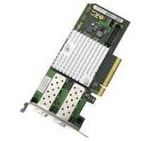 | Fujitsu D2755-A11   | 2x 10Gbit                                                      |                                                                        |

### Storage

| Image                             | Name            | Purpose         | Notes                                                  |
| --------------------------------- | --------------- | --------------- | ------------------------------------------------------ |
| 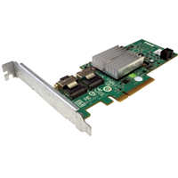 | Dell PERC H200  | 2x SAS (6Gbps)  | Can be broken out into 2x 4 Sata with a breakout cable |
| 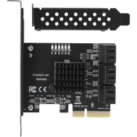   | TISHRIC ASM1166 | 6x SATA (6Gbps) |                                                        |

### GPUs

| Image                             | Name             | Purpose       | Notes |
| --------------------------------- | ---------------- | ------------- | ----- |
| 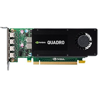     | Quadro K1200     | 4GB VRAM GPU  |       |
| 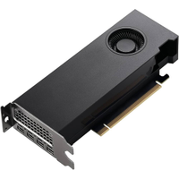 | RTX A2000        | 12GB VRAM GPU |       |
| 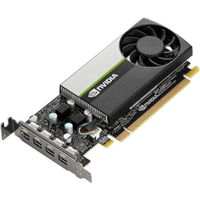         | NVIDIA T600/1000 | 4GB/8GB VRAM  |       |

### Other

| Image                           | Name         | Purpose                                            | Notes |
| ------------------------------- | ------------ | -------------------------------------------------- | ----- |
| 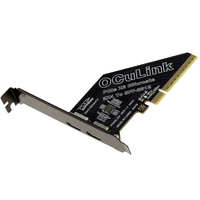 | Oculink Card | Oculink SFF 8612 interfaces through a PCIe x8 slot |       |

---

## 3D printed mounts

### Rack mounts

| Image                                                             | Name                                                                                                                                                                     |
| ----------------------------------------------------------------- | ------------------------------------------------------------------------------------------------------------------------------------------------------------------------ |
| 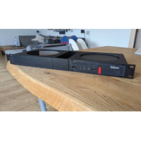 | [Improved Thinkcentre Tiny 1U Rack](https://www.thingiverse.com/thing:6375095)                                                                                           |
| 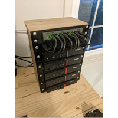                         | [Mini PC server case rack](https://www.thingiverse.com/thing:6651463)                                                                                                    |
| 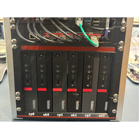         | [Lenovo Tiny Vertical Holder for DeskPi 10" rack](https://makerworld.com/en/models/1216152-lenovo-tiny-vertical-holder-for-deskpi-10-rack?from=search#profileId-1232034) |
| 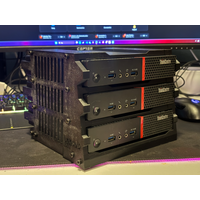                             | [ThinkCentre Tiny Tower (v2)](https://makerworld.com/en/models/773096-thinkcentre-tiny-tower-v2?from=search#profileId-709241)                                            |
| 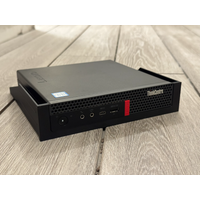                           | [OpenRack 1U - Lenovo ThinkCentre M720](https://makerworld.com/en/models/1480687-openrack-1u-lenovo-thinkcentre-m720?from=search#profileId-1546016)                      |
| 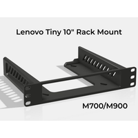                 | [ThinkCentre Tiny 10" Rack Mount](https://makerworld.com/en/models/2533762-thinkcentre-tiny-10-rack-mount?from=search#profileId-2788743)                                 |
| 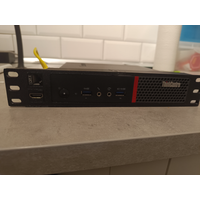               | [thinkcentre 10 inch rackmount](https://makerworld.com/en/models/1141511-thinkcentre-10-inch-rackmount?from=search#profileId-1143992)                                    |

## HDD caddy-s

https://www.thingiverse.com/thing:4231309

---

## Where to find/buy

[LowCostMiniPcs.com](https://www.lowcostminipcs.com)

Local marketplaces, vinted, craigslist, facebook marketplace.
